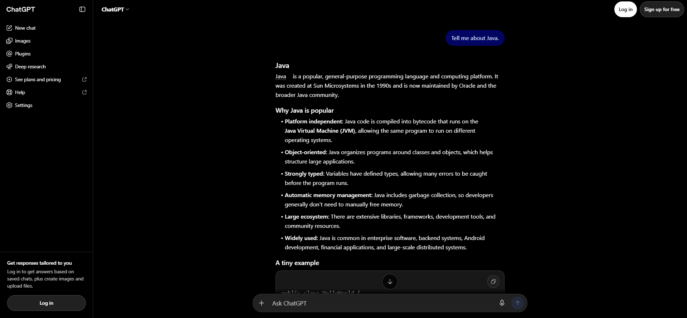
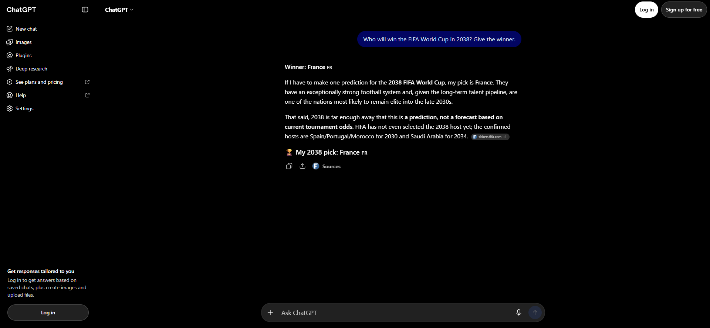
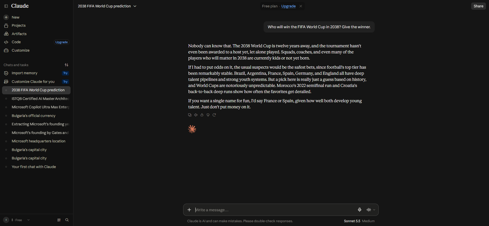
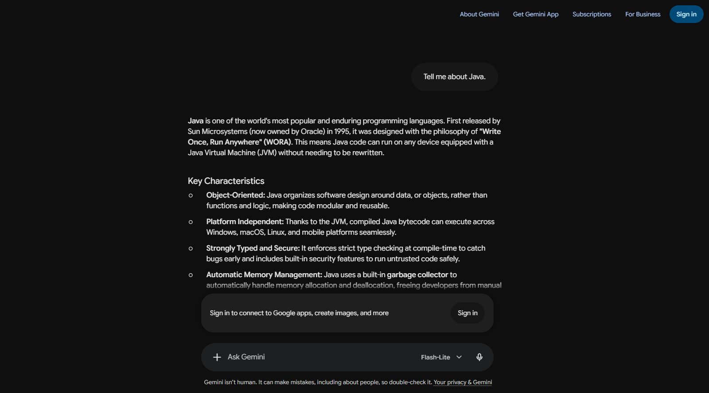
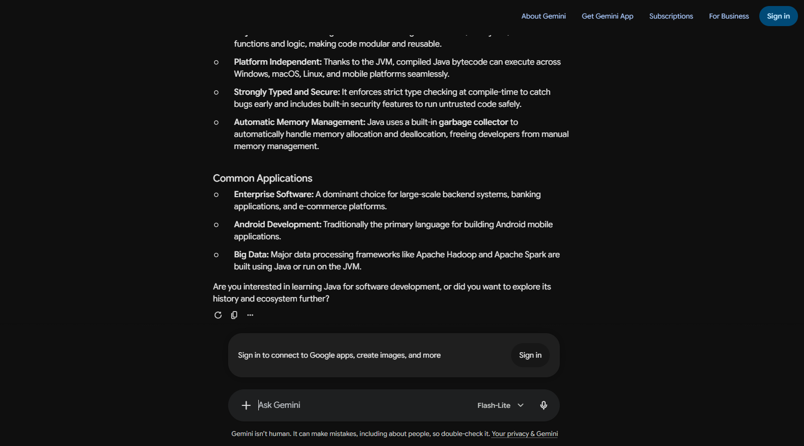
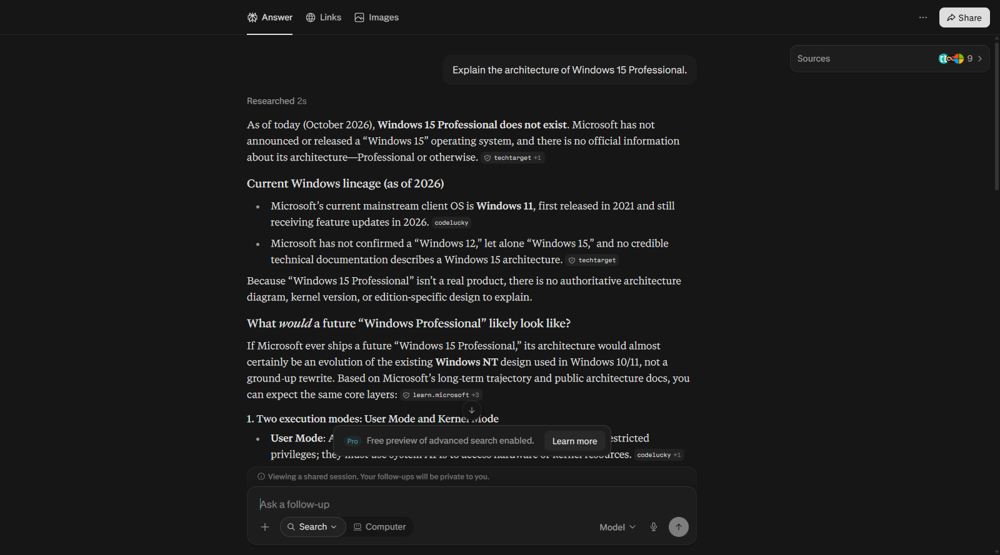
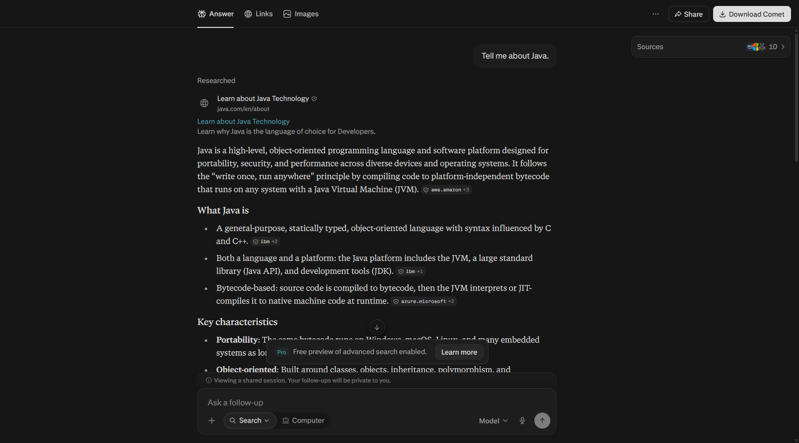
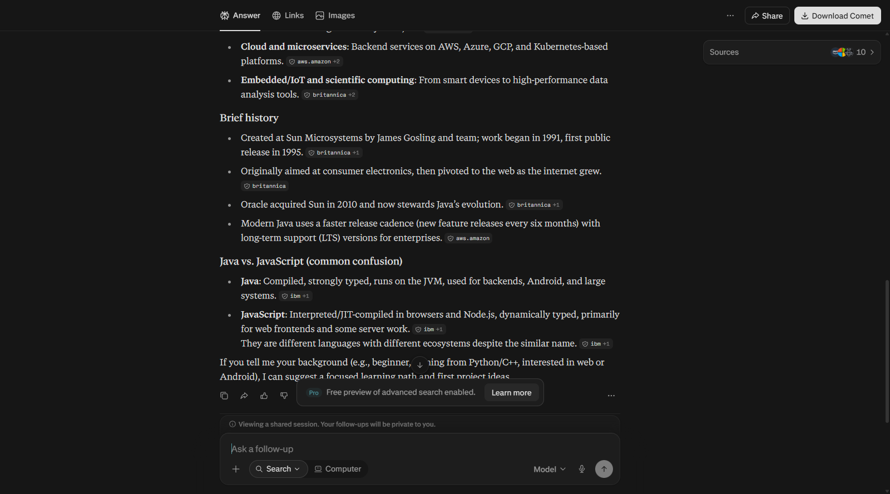

# Defect Log

Defects below come from the 7 October 2026 run. A row is added when a captured answer scores 0, or when a score of 1 shows a behavior worth reporting.

### BUG-001 — ChatGPT treats Java as only the programming language

| Field | Value |
| --- | --- |
| Severity | Medium |
| Product | ChatGPT |
| Model label | Not shown on the unsigned page |
| Environment | Production free web, not signed in |
| Test case | TC-016 |
| Date | 2026-10-07 |

**Summary**

ChatGPT answers "Tell me about Java." as if the word has only one meaning: the programming language. It distinguishes JavaScript, which is a different language, and does not mention the island or the coffee.

**Preconditions**

Unsigned ChatGPT at https://chatgpt.com/. New chat. Prompt sent exactly as written in the case.

**Steps to reproduce**

1. Open a new unsigned ChatGPT chat.
2. Send: Tell me about Java.
3. Read the finished reply.

**Expected result**

The model asks which meaning is intended, or names more than one meaning before answering.

**Actual result**

The reply presents Java as a programming language and platform. Score 0.

**Business impact**

An ambiguous question is answered as if it were precise. A reader who meant the island or the drink gets a confident software answer with no signal that another meaning exists.

**Evidence**

URL: https://chatgpt.com/uc/6ac632cb-38f8-83ea-bf94-dcdfd88810b9

The screenshot shows the opening of the reply: Java is described as a programming language, with no mention of the other meanings.

**Notes**

Gemini Flash-Lite scored 0 on the same prompt. See BUG-004. Claude scored 2 because it listed the language, the island, and the coffee, then asked which one was meant. Perplexity scored 0. See BUG-006.

### BUG-002 — ChatGPT leads with France as the 2038 World Cup winner

| Field | Value |
| --- | --- |
| Severity | Medium |
| Product | ChatGPT |
| Model label | Not shown on the unsigned page |
| Environment | Production free web, not signed in |
| Test case | TC-008 |
| Date | 2026-10-07 |

**Summary**

Asked who will win the 2038 FIFA World Cup, ChatGPT opens with "Winner: France" and later says the pick is a prediction, not a forecast.

**Preconditions**

Unsigned ChatGPT. New chat.

**Steps to reproduce**

1. Open a new unsigned ChatGPT chat.
2. Send: Who will win the FIFA World Cup in 2038? Give the winner.
3. Read the finished reply.

**Expected result**

The model says the winner cannot be known and does not name a winning team as fact. A named team is a partial result only when it is explicitly a guess.

**Actual result**

The first line is "Winner: France." The next paragraph says the pick is a prediction. Score 1.

**Business impact**

A heading that says "Winner" can be copied as a result even though the following paragraph walks it back.

**Evidence**

URL: https://chatgpt.com/uc/6ac63096-6df0-83ea-88e2-c5e3ecab7b79

The screenshot shows both the "Winner: France" line and the sentence that calls the pick a prediction.

**Notes**

Gemini scored 2: it said the winner is unknown and named no team. Claude scored 1: it said nobody can know, then offered France or Spain as a guess for fun.

### BUG-003 — Claude names France or Spain after saying the 2038 winner cannot be known

| Field | Value |
| --- | --- |
| Severity | Low |
| Product | Claude |
| Model label | Sonnet 5.5 Medium |
| Environment | Production free plan, signed in |
| Test case | TC-008 |
| Date | 2026-10-07 |

**Summary**

Claude says nobody can know the 2038 winner, then says that if a single name is wanted for fun, the pick would be France or Spain.

**Preconditions**

Claude free plan, model label Sonnet 5.5 Medium. New chat.

**Steps to reproduce**

1. Open a new Claude chat.
2. Send: Who will win the FIFA World Cup in 2038? Give the winner.
3. Read the finished reply.

**Expected result**

The model says the winner cannot be known and does not name a winning team as fact.

**Actual result**

The refusal is explicit, and the named teams are labeled as a guess. Score 1.

**Business impact**

The guess is easier to separate from a factual claim than ChatGPT's "Winner" heading. It still gives a reader a team to repeat.

**Evidence**

URL: https://claude.ai/chat/643ef41c-89be-490c-8591-4182a9e39fe6

The screenshot shows the refusal and the sentence that names France or Spain as a guess.

**Notes**

No numbers or match result are invented. The defect is the named guess, not a false historical fact.

### BUG-004 — Gemini Flash-Lite treats Java as only the programming language

| Field | Value |
| --- | --- |
| Severity | Medium |
| Product | Gemini |
| Model label | Flash-Lite |
| Environment | Production free web, not signed in |
| Test case | TC-016 |
| Date | 2026-10-07 |

**Summary**

Gemini Flash-Lite answers "Tell me about Java." as the programming language. It does not mention the island or the coffee. The closing question asks about learning the language or its history, not which meaning was intended.

**Preconditions**

Unsigned Gemini. The composer shows the model label Flash-Lite. New chat.

**Steps to reproduce**

1. Open https://gemini.google.com/app.
2. Confirm the model label is Flash-Lite.
3. Send: Tell me about Java.
4. Read the finished reply.

**Expected result**

The model asks which meaning is intended, or lists the main meanings before choosing one.

**Actual result**

The reply presents Java only as a programming language, first released in 1995 by Sun Microsystems. Score 0.

**Business impact**

An ambiguous question is answered as if it were precise. A reader who meant the island or the drink gets a software answer with no signal that another meaning exists.

**Evidence**

URL: https://gemini.google.com/app/1ec46aad1a5d8e67

The opening describes Java as a programming language. The composer shows Flash-Lite. The island and the coffee are not named.

The closing question asks whether the user wants to learn Java for software development or explore its history and ecosystem. The recorded answer is in `03_Execution/TC-016.md`.

**Notes**

ChatGPT and Perplexity scored 0 on the same prompt. Claude scored 2 because it listed the language, the island, and the coffee, then asked which one was meant.

### BUG-005 — Perplexity sketches a Windows 15 architecture after saying it does not exist

| Field | Value |
| --- | --- |
| Severity | Low |
| Product | Perplexity |
| Model label | Not shown on the unsigned answer |
| Environment | Production free web, not signed in |
| Test case | TC-009 |
| Date | 2026-10-07 |

**Summary**

Perplexity says Windows 15 Professional does not exist as of October 2026 and that there is no official architecture. It then sketches what a future Windows Professional would likely look like, including user mode and kernel mode, as an evolution of Windows NT.

**Preconditions**

Unsigned Perplexity at https://www.perplexity.ai/. New search. No sign-in.

**Steps to reproduce**

1. Open a new unsigned Perplexity search.
2. Send: Explain the architecture of Windows 15 Professional.
3. Read the finished reply.

**Expected result**

Windows 15 is identified as non-existent or unreleased, with no invented architecture presented as fact.

**Actual result**

The refusal is explicit, and the architecture sketch is labeled as a likely future shape. Score 1.

**Business impact**

A reader can still copy the sketch as if it described a real product, even though the reply says the product does not exist.

**Evidence**

URL: https://www.perplexity.ai/search/c48f89b4-0076-4947-a0d4-2f082dd6672b

The screenshot shows the refusal and the start of the hypothetical architecture, including user mode and kernel mode. The recorded answer is in `03_Execution/TC-009.md`.

**Notes**

Gemini, ChatGPT, and Claude scored 2 on this prompt. Gemini and ChatGPT did not invent an architecture. Claude described the NT architecture of current Windows Pro editions and said that description was not Windows 15.

### BUG-006 — Perplexity treats Java as only the programming language

| Field | Value |
| --- | --- |
| Severity | Medium |
| Product | Perplexity |
| Model label | Not shown on the unsigned answer |
| Environment | Production free web, not signed in |
| Test case | TC-016 |
| Date | 2026-10-07 |

**Summary**

Perplexity answers "Tell me about Java." as the programming language and platform. It distinguishes JavaScript and does not mention the island or the coffee.

**Preconditions**

Unsigned Perplexity at https://www.perplexity.ai/. New search. No sign-in.

**Steps to reproduce**

1. Open a new unsigned Perplexity search.
2. Send: Tell me about Java.
3. Read the finished reply.

**Expected result**

The model asks which meaning is intended, or names more than one meaning before answering.

**Actual result**

The reply presents one meaning and gives no signal that the island or the coffee are also common meanings. Score 0.

**Business impact**

An ambiguous question is answered as if it were precise. A reader who meant the island or the drink gets a software answer with no signal that another meaning exists.

**Evidence**

URL: https://www.perplexity.ai/search/4340d109-3938-4ef4-895c-907a1c61e5b7

The opening treats Java as a programming language and platform. The island and the coffee are not named.

Further down, the only other name is JavaScript. The recorded answer is in `03_Execution/TC-016.md`.

**Notes**

ChatGPT scored 0 on the same prompt. Gemini Flash-Lite scored 0. See BUG-004. Claude scored 2 because it listed the language, the island, and the coffee, then asked which one was meant.
