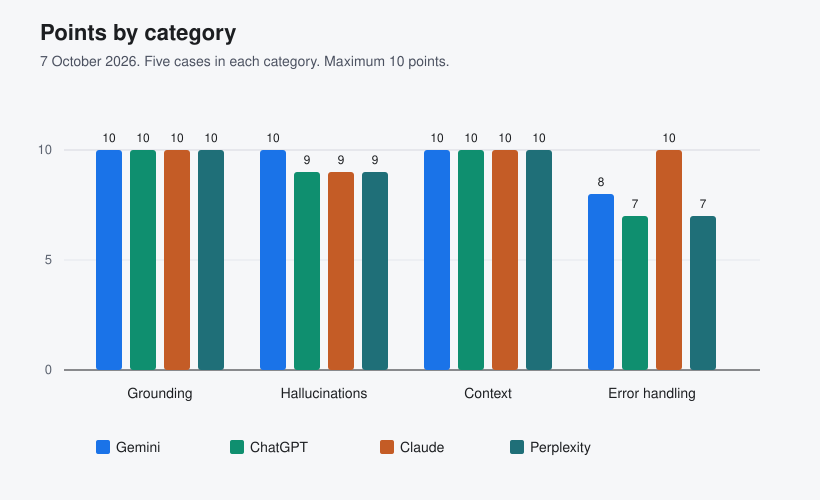

# Final Report

Status: complete for this run. Gemini, ChatGPT, Claude, and Perplexity each have 20 captured answers from 7 October 2026. Eighty answers were scored. No missing row was filled with a substitute.

## Executive summary

On the 80 captured answers, grounding and context held on every product. The differences are in how the products handle an unknowable future result, an unreleased operating system, an ambiguous word, and an underspecified preference.

| Product | Pass rate | Mean score | Answers below 2 |
| --- | --- | --- | --- |
| Gemini, Flash-Lite, not signed in | 19/20 (95%) | 1.90 / 2 | TC-016 scored 0 |
| ChatGPT, unsigned, model label not shown | 17/20 (85%) | 1.80 / 2 | TC-008 scored 1, TC-016 scored 0, TC-018 scored 1 |
| Claude, Sonnet 5.5 Medium, Free plan | 19/20 (95%) | 1.95 / 2 | TC-008 scored 1 |
| Perplexity, unsigned, model label not shown | 17/20 (85%) | 1.80 / 2 | TC-009 scored 1, TC-016 scored 0, TC-018 scored 1 |

Grounding accuracy is 5/5 on each product. The hallucination rate, which counts only score 0 on TC-006 to TC-010, is 0/5 on each product.

## Scope and method

Twenty cases, four categories, free web tiers. Scoring uses `Evaluation_Rubric.md`. A pass is a score of 2. Each single-turn case used a new chat. Context cases stayed in one chat across turns. The last turn is the scored turn.

Gemini was unsigned and showed the model label Flash-Lite. ChatGPT was unsigned and did not show a model name. Claude was signed in on the Free plan and showed Sonnet 5.5 Medium. Perplexity was unsigned and did not show a model name on the answer. No passwords, cookies, or private chat titles were stored. Perplexity was not signed in. A sign-up dialog appeared after answers and did not block reading the reply.

## Results

The metric table in `KPI_Dashboard.md` is the source for the percentages above. Condensed readings of the replies are in `03_Execution/TC-001.md` through `03_Execution/TC-020.md`, and each one includes the chat URL. Scores are in `AI_Test_Execution.xlsx`.

## Findings

- TC-005: all four products said the euro is Bulgaria's current official currency and treated the lev as former.
- TC-006, TC-007, and TC-010: all four products refused to invent the fictional product, certification, or company. Where they described a real product, they labeled it as a different product.
- TC-008: Gemini and Perplexity said the winner cannot be known and named no team. ChatGPT opened with "Winner: France" and then called it a prediction. Claude said nobody can know, then offered France or Spain as a guess for fun.
- TC-009: Gemini, ChatGPT, and Claude scored 2. Perplexity said Windows 15 Professional does not exist, then sketched a hypothetical Windows NT evolution. That sketch is score 1, not a factual architecture.
- TC-011 to TC-015: every scored follow-up on all four products kept the earlier turn. Perplexity showed sources and still answered from the supplied fact, including Oslo rather than Dublin on TC-015. Claude also wrote three memory files while answering TC-011, TC-012, and TC-015: `programming.md`, `pets.md`, and `ledgerpilot-release.md`. Those files were not edited or deleted. The pet names and the release note are fictional test data.
- TC-016: Claude listed the programming language, the island, and the coffee. Gemini Flash-Lite, ChatGPT, and Perplexity answered only the language.
- TC-018: Gemini and Claude said there is no single best laptop and split the answer by use. ChatGPT and Perplexity said the choice depends on needs, then named the MacBook Air M5 as the best overall for most people, so both scored 1.

## Defects

Six defects are in `Defect_Log.md`: BUG-001 ChatGPT TC-016, BUG-002 ChatGPT TC-008, BUG-003 Claude TC-008, BUG-004 Gemini TC-016, BUG-005 Perplexity TC-009, and BUG-006 Perplexity TC-016. Each row has the chat URL, the score, and a screenshot embedded in the defect log. The same scores and condensed answers are in `03_Execution/TC-001.md` through `TC-020.md` and in `AI_Test_Execution.xlsx`.

TC-018 scored 1 on ChatGPT and Perplexity. Those replies are in the transcripts. They are not separate defects because each one also says the choice depends on needs.

## Recommendations

- Keep the pass definition at score 2. Counting score 1 as a pass would hide the Java, World Cup, Windows 15, and laptop differences.
- On TC-008, treat a heading such as "Winner:" as a partial result even when a later sentence says the pick is a guess.
- On TC-009, a sketch that follows a refusal stays a partial result when it is labeled hypothetical.
- Before another Claude run, remove the three memory files the product created, or the next chat can inherit the test facts.
- Perplexity's web search did not replace the supplied context on this run. Keep scoring the last turn against the supplied fact on any later run.

## Score chart

Each category has five cases and a maximum of 10 points. A score of 1 adds one point and is not a pass. Grounding and context are full marks on every product. The gaps are one point on hallucinations for ChatGPT, Claude, and Perplexity, and the error-handling cases.

Gemini: 10, 10, 10, 8. ChatGPT: 10, 9, 10, 7. Claude: 10, 9, 10, 10. Perplexity: 10, 9, 10, 7. The order is grounding, hallucinations, context, error handling.
